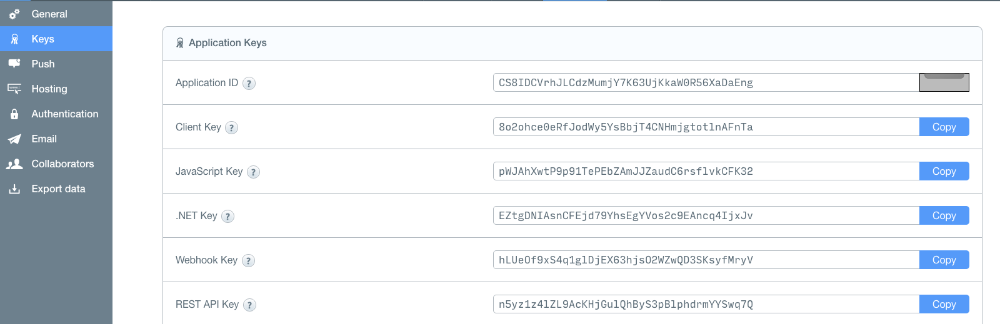

ParseSendClient
==============================

Parse push send client.

Use Parse REST API Push Notifications

[Parse REST API](https://parse.com/docs/rest/guide/#quick-reference-push-notifications)

Usage
====

# parsepush.properties
| property  | description |
| ------------- | ------------- |
| PARSE_APPLICATION_ID | your Application ID |
| PARSE_REST_API_KEY | your Client Key |
| PARSE_REST_API_KEY | your REST API Key |

License
--------

Copyright (c) 2015 Bowyer
Released under the MIT license
http://opensource.org/licenses/mit-license.php
